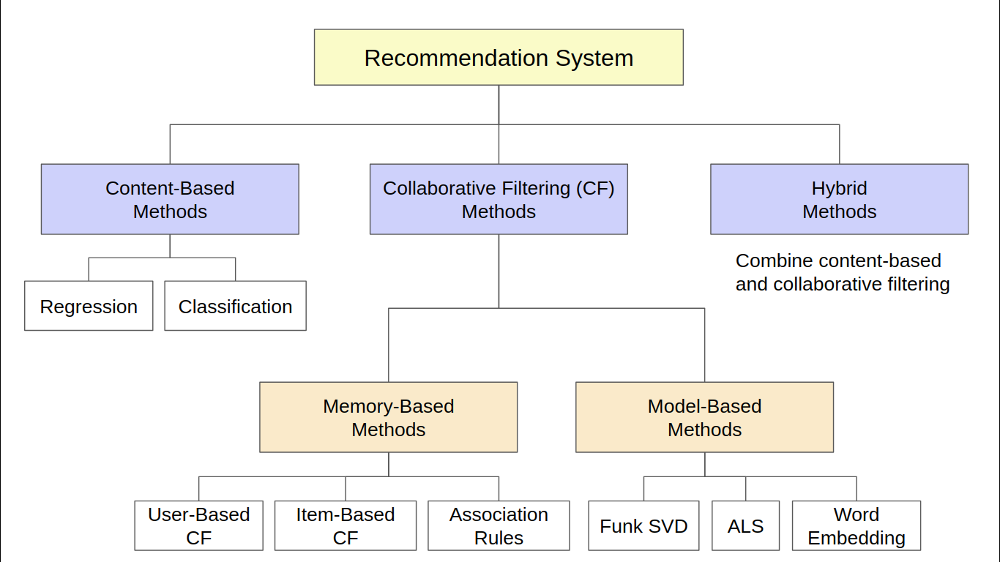
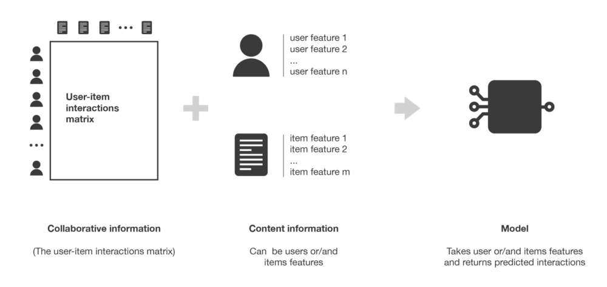
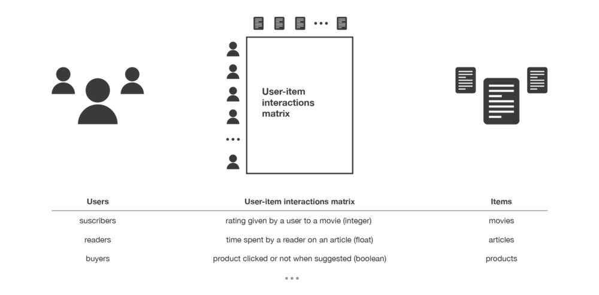

```{r setup, include=FALSE}
knitr::opts_chunk$set(echo = TRUE, fig.align = "center", out.width = "80%")

library(tidyverse)
```

# Introduction

You may have been familiar with what a recommendation system is. With the rise of big data and computation power, you can see recommender system everywhere, from the famous Netflix movie recommendation[^1], the controversial Youtube algorithm[^2], or even the product placement of your e-commerce platform or nearby supermarket[^3]. But how does a recommendation system works? There are a lot of articles and websites that have discussed this topic already. This article would not be too much difference, but I will try to guide you to understand how recommendation system works and how to build and evaluate it, especially for R user.

## What is Recommendation System

So, what is a recommendation system and what makes it different from other machine learning algorithm like the regression and classification model? A recommendation system, as its name suggests, is an algorithm that tried to predict what items (movies, products, etc.) that likely you gonna like based on historical data and other complementary information. 

For a simple illustration, this is how commonly a recommendation system works. Based on the retail sales data, a person who like to buy banana will more likely to buy milk, bread, and carrot as well. 

```{r echo=FALSE}

```

There are many type of recommendation algorithm but we can define them into the following several categories with some example of the algorithm. 

```{r echo=FALSE}

```

- **Content-Based Method**

The content-based method is a collection of algorithm that rely on information about the item and/or the user. For example, if we build a recommendation system for e-commerce, the information will be the user age, gender, and residence while the information about item is about the category, price, and grade. The idea of content-based methods is to try to build a model, based on the available “features” that explain the observed user-item interactions. Sometimes the algorithm is combined with other approach such as suggesting the popular item or randomly give recommendation to user.

```{r echo=FALSE}

```

- **Collaborative Filtering Method**

Collaborative filtering method get its name because the algorithm use all available information gathered by historical data about rating given by users. Thus, this method only use the user-item interaction like the following figure. The advantage of collaborative filtering method is that it doesn't require additional information and easier to implement than using the content-based method, where we need to gather the information regarding the item/user. However, the collaborative filtering method suffers from the `cold start problem`. When a new user come and has not interacted with any item, the algorithm can't give recommendation for the user.

```{r echo=FALSE}

```

Typically, the user-item interactions are represented as a matrix with the rating as the value of the matrix. If the rating information is not available and hard to collect, the value can be filled with the information whether the user has buy the item or watch the movie.

```{r}
set.seed(123)
mat_sample <- matrix(round(runif(16, min = -10, max = 10)), 
                     nrow = 4) %>% 
  as.data.frame() %>% 
  mutate_all(.funs = function(x) ifelse(x < 1, NA, x)) %>% 
  `rownames<-`(paste0("user_", 1:4)) %>% 
  setNames(paste0("item_", 1:4))

mat_sample
```

The collaborative filtering method can be divided into two different groups: 

- **Memory-Based Method**

The memory-based method only tried to recommend items to user based on the similarity between user. Users will be recommended with item from other users with similar behavior (buy the same products, watch the same movies, give product with same rating). This approach works directly with the rating or the value of the matrix without fitting any model or representation. Some people call this method a `nearest neighbour` approach since it tried to find the closest neighbour or other users that has the highest similarity. Some example of algorithms that belong to this group is the item-based collaborative filtering (IBCF), user-based collaborative filtering (UBCF), and association rule. I have written about association rule in another post[^4] if you wish to understand them.

- **Model-Based Method**

The model-based method tries to make a representation of the user-item matrix to predict items that has not been rated or interacted with user. The popular method to get the representation of the matrix is through matrix factorization, which break down the user-item matrix into several different matrix.

- **Hybrid Method**

The hybrid method combine the result from several algorithms, be it using content-based method or collaborative filtering method.

I recommend you to read the following article[^5] to get the full explanation of the recommendation system. On this article, I will only focus on the matrix factorization method called Funk SVD, developed by Simon Funk.

## Matrix Factorization

Matrix factorization decompose or break down the user-item matrix into lower dimentionality matrix. One of the popular method of matrix factorization is the Funk SVD, which has won the Netflix prize competition [^6].

The Funk SVD method tried to make a matrix decomposition that can approximate the value of the real matrix as close as possible (with minimum error).

$$A \approx U\ V^T$$

The method use the Sum of Squared Error (SSE) as the error term that will be minimized via Stochastic Gradient Descent[^7]. To make the model generalize well and not over-fit the training set, we implement a penalty term to our minimization equation. This is represented by a regularization factor $\lambda$ multiplied by the sum of square of the magnitudes of user and item vectors.

$$min\ \Sigma_{i,j \in obs}\ (A_{ij} - U_i\ V_j^T)^2 + \lambda (\ ||U_i||^2 + ||V^T_j||^2\ )$$

Notation 

$A$ : the real user-item rating matrix

$A_{i,j}$ : rating given by user $i$ for item $j$

$U_i$ : latent factor for user $i$

$V^T_j$ : latent factor for item $j$

Suppose we have the following actual real rating matrix.

```{r}
mat_sample
```

We initialize the $U$ matrix of user latent factor with 3 features/factors and filled with randomized value.

```{r}
set.seed(123)
u_init <- matrix(runif(12, min = -3, max = 3) %>% round(2), 
                     nrow = 4) %>% 
  as.data.frame() %>% 
  `rownames<-`(paste0("user_", 1:4)) %>% 
  setNames(paste0("factor_", 1:3))

u_init
```

We initialize the $V^T$ matrix of item latent factor with 3 features/factors and filled with randomized value.

```{r}
set.seed(13)
i_init <- matrix(runif(12, min = -3, max = 3) %>% round(2), 
                     nrow = 3) %>% 
  as.data.frame() %>% 
  `rownames<-`(paste0("factor_", 1:3)) %>% 
  setNames(paste0("item_", 1:4))

i_init
```

Suppose we want to get the rating of the $user_1$ and $item_2$, which has actual rating of **9**. We simply multiply the $U$ matrix with the $V^T$ matrix for $user_1$ and $item_2$.

$$\hat {r} = U\ V^T = \begin{bmatrix} -1.27 & 2.64 & 0.31 \end{bmatrix} \begin{bmatrix}
  -2.45 \\
  2.77 \\
  -2.93 \\
\end{bmatrix} = 9.516$$

Now we calculate the squared error of the prediction.

$$Error = (9 - 9.516)^2 = 0.266$$

After that, we update the value of the $U$ and $V^T$ matrix using the SGD with regularization. 

Now to get your hand dirty, we will start to do a use case of recommendation system using data from Amazon.

# Library and Setup

The following package is required if you wish to replicate the result of this post. All source code are available on my [github repository](https://github.com/Argaadya/Recommender).

```{r message=FALSE}
# Data Wrangling
library(tidyverse)
library(lubridate)

# Data Visualization
library(scales)
library(skimr)

# Recommender System
library(recommenderlab)

options(scipen = 999)
```

# Import Data

Data is acquired from [Amazon Review Data (2018)](https://nijianmo.github.io/amazon/index.html). The data consists of 2 separate datasets:

- rating : The rating given by each user to each time with a timestamp
- metadata : The metadata/information about each video game item/accessories

We have over 2 millions rating given by users and more than 80,000 different video game items. The metadata is already cleansed previously. You can visit github repo to check the cleansing method.

```{r}
rating <- data.table::fread("data/Video_Games.csv")
metadata <- data.table::fread("data/metadata.csv")
metadata <- metadata %>% 
  select(asin, title, category1, category2, category3, price, brand, feature, tech1, tech2, image, description)

cat("----------Rating Dataset----------\n")
glimpse(rating)
```

Data Description :

- **V1** : item id
- **V2** : user id
- **V3** : rating given by the user
- **V4** : timestamp of the rating

We will rename the column name of the rating dataset and transform the timestamp from integer to proper date format. The rating dataset contain essential informations for us to build the recommendation system. On the later analysis, we will convert this rating dataset into something called user-item rating matrix.

```{r}
rating <- rating %>% 
  set_names(c("item", "user", "rating", "timestamp")) %>% 
  mutate(
    timestamp = as_datetime(timestamp)
  )

head(rating, 10)
```

The metadata consists of the relevant information of each video game title and accessories, including the product name, category, price, etc. The metadata can be used to give proper recommendation output because I am sure we will not give an item id to user and let them figure what the product name of the recommended item. This metadata is not essential if we don't use them as part of the recommendation system, for example if we want to build the recommendation system based on the category and brand of the item.

```{r}
cat("\n\n----------Metadata Dataset----------\n")
glimpse(metadata)
```

Data description:

- **asin** : item id
- **title** : name of the product
- **category** : categories the product belongs to
- **price** : price in US dollars (at time of crawl)
- **brand** : brand name
- **feature** : bullet-point format features of the product
- **tech** : the technical detail table of the product
- **image** : url of the product image
- **description** : description of the product


# Exploratory Data Analysis (EDA)

We need to be more familiar with our data before building the model. Through exploratory data analysis, we first try to look at the data more closely, by summarizing or inspecting the data. As we go through the EDA process, we can find that perhaps not all data should be used or that we may need to transform or preprocess the data first.

## Does a single user can rate a single video game multiple time?

We will check by counting how many times an item is rated by a single user. 

```{r}
rating %>% 
  count(item, user) %>% 
  arrange(desc(n)) %>% 
  head(10)
```

As we can see, a item can be rated more than once by a single user, perhaps they buy them multiple times or there are duplicate data. Depending on your purpose, you can calculate the mean of the rating or you can just choose the recent rating only. Thus, for the next analysis we will only consider the latest rating given by the user and ignore the rest. 

```{r}
rating <- rating %>% 
  group_by(item, user) %>% 
  arrange(desc(timestamp)) %>% # Arrange rating by timestamp 
  slice(1) %>% # Take only the latest rating
  ungroup()

cat(
  paste("Number of Unique Rating :", nrow(rating) %>% prettyNum(big.mark = ","))
  )
```

## Video Games Rating Distribution

Let's check the frequency of rating given to each game. Based on the summary, some games are rated only once or twice. On average, a item is rated 5 times based on the median value.

```{r}
game_count <- rating %>% 
  count(item)

game_count %>% 
  skim()
```

For the next analysis, we will only consider items that's been rated at least 50 times. The choice of number of rating is arbitrary, you can set the limit yourself. After we filter out the item, the number of rating is significantly reduced.

```{r}
select_item <- game_count %>%  
  filter(n > 50) %>% 
  pull(item)

# Update the rating
rating <- rating %>% 
  filter(item %in% select_item)

cat(
  paste("Number of Rating :", nrow(rating) %>% prettyNum(big.mark = ","))
  )
```

## User Rating Distribution

Now that we have the updated rating data, we check the frequency of each rating score (1-5) given by user. Based on the bar chart, most user will give rating score of 5 for the game they've bought.

```{r message=FALSE}
rating %>% 
  ggplot(aes(rating)) +
  geom_bar(fill = "firebrick") +
  scale_y_continuous(labels = number_format(big.mark = ",")) +
  labs(x = "Rating", y = "Frequency",
       title = "Number of Rating Given by User") +
  theme_minimal()
```

We also check how many video games a user have been rated by looking at the distribution. Based on the statistics, most user only rate a single game item. This data may not informative to us since we don't know what other item that those user also buy.

```{r}
user_count <- rating %>% 
  count(user)

user_count %>% 
  skim()
```

For the next analysis, we will only consider users who've rated at least 10 different games. Again, this choice is arbitrary.

```{r}
select_user <- user_count %>% 
  filter(n > 10) %>% 
  pull(user)

# update rating
rating <- rating %>% 
  filter(user %in% select_user)

cat(
  paste("Number of Rating :", nrow(rating) %>% prettyNum(big.mark = ","))
  )
```

This will also decrease the dimension for our dataset with only `r n_distinct(select_user)` users remaining. We omit most of the user since they only give one rating and most game are only rated once so they are not very informative.

Let's once again check the rating distribution.

```{r}
rating %>% 
  ggplot(aes(rating)) +
  geom_bar(fill = "firebrick") +
  scale_y_continuous(labels = number_format(big.mark = ",")) +
  labs(x = "Rating", y = "Frequency",
       title = "Number of Rating Given by User") +
  theme_minimal()
```

We may also check the number of rating frequency over time. The graph below shows that rating activity reach its peak around 2015 and start to decrease afterwards. 

```{r}
rating %>% 
  mutate(
    timestamp = floor_date(timestamp, unit = "week")
  ) %>% 
  count(timestamp, rating) %>% 
  ggplot(aes(timestamp, n, color = as.factor(rating), group = rating)) +
  geom_line() +
  scale_color_brewer(palette = "Dark2") +
  scale_x_datetime(date_breaks = "2 year", labels = date_format(format = "%Y")) +
  labs(x = NULL, y = "Frequency",
       title = "Weekly Frequency of Rating Activity",
       color = "Rating") +
  theme_minimal() +
  theme(legend.position = "top")
```

We can check the most rated game at time interval between 2014 and 2016 by joining the rating data with the item metadata. 

```{r}
rating %>% 
  filter(year(timestamp) > 2014,
         year(timestamp) < 2016) %>% 
  count(item) %>% 
  arrange(desc(n)) %>% 
  head(10) %>% 
  left_join(metadata, by = c("item" = "asin"))
```

# Data Preprocessing

After we finished exploring the data, we will convert the data into a matrix, with the row is the user and each column is the item/item. The value in each cell is the rating given by the user. If the user haven't rated any item, the cell value will be a missing value (NA).

We can make a recommendation system using 2 type of matrix:

- **Real Rating Matrix** 

Each cell represent a normalized rating given by the user. Below is the example of a non-normalized real rating matrix with 3 users and 3 items.

```{r}
# example
matrix(data = c(NA, NA, 1, 5, NA, 3, 4, NA, 2), nrow = 3, 
       dimnames = list(c("user_1", "user_2", "user_3"), 
                       c("item_1", "item_2", "item_3")))
```

- **Binary rating matrix** 

Each cell represent a response given by the user and can only have binary values (recommended/not recommended, good/bad).

```{r}
# example
matrix(data = c(NA, 1, NA, 0, 1, 1, 0, NA, 1), nrow = 3, 
       dimnames = list(c("user_1", "user_2", "user_3"), 
                       c("item_1", "item_2", "item_3")))
```

Below is the real rating matrix of our data. From 133,197 ratings, we have build a 7,113 x 8,550 rating matrix.

```{r message=FALSE}
rating_matrix <- rating %>% 
  select(item, user, rating) %>% 
  reshape2::dcast(user ~ item) %>% # Convert long data.frame to wide data.frame
  column_to_rownames("user") %>% 
  as.matrix() %>% 
  as("realRatingMatrix")

rating_matrix
```

We may peek inside the sample of the matrix. Since a user rarely give rating to all available items, the matrix is mostly empty. This kind of matrix is called the sparse matrix because mostly it's sparse and has missing value. On the example below, we only have 2 ratings from 9 user and 9 items. 

```{r}
rating_matrix@data[1:9, 2001:2009]
```

As you can see, the value is not normalized yet and still in range of [1,5]. Since we use the real rating matrix, we need to normalize the rating. However, you can also skip this step since the model fitting will normalize the data by default. You can normalize the data via two method:

- Normalization by mean (center method)

We normalize the data by subtracting the data with it's own mean for each user.

$$normalized\ x = x - \overline x$$

- Normalization by Z-score

We use the Z-score of the standard normal distribution to scale the data.

$$Z = \frac{(x - \overline x)^2}{s}$$

We don't have to manually normalize the rating matrix, since the model fitting process in `recommenderlab` will normalize our data by default. But if you want to do it outside the model, you use the `normalize()` function and determine the method, either `center` method or `Z-score` method

```{r}
normalize(rating_matrix, method = "center")
```

# Building Recommender System

The data is ready. Now we can start building the recommendation system. There are several algorithm that you can use to build a recommendation system using the `recommenderlab` package. You can check it by looking at the registry and specify the data type. Below are some recommendation algorithm for a rating matrix with real value.

```{r}
recommenderRegistry$get_entries(dataType = "realRatingMatrix") %>% 
  names()
```

Description :

- POPULAR : Popular Recommendation
- UBCF : User-Based Collaborative Filtering
- IBCF : Item-Based Collaborative Filtering
- RANDOM : Random Recommendation
- SVD : Singular Value Decomposition 
- SVDF : Funk Singular Value Decomposition

For now, let's start make a recommendation system with the Funk SVD method. You can check the initial/default parameter of the model.

```{r}
recommenderRegistry$get_entry("SVDF", dataType = "realRatingMatrix")
```

Description:

- **k** : number of features (i.e, rank of the approximation).
- **gamma** : regularization term.
- **lambda** : learning rate.
- **min_improvement** : required minimum improvement per iteration.
- **min_epochs** : minimum number of iterations per feature.
- **max_epochs** : maximum number of iterations per feature.
- **verbose** : show progress.

We will modify the parameter by using Z-score normalization instead.

```{r eval=FALSE}
recom_svdf <- Recommender(data = rating_matrix,
                         method = "SVDF",
                         parameter = list(normalize = "Z-score")
                         )
```

```{r}
recom_svdf <- read_rds("output/svdf.Rds")
```


# Give Recommendation

Now we will try to generate a random new user to simulate the recommendation process. Let's say we have the following new users who only gave a single or two rating. 

```{r}
select_item <- unique(rating$item)

set.seed(251)
new_user <- data.frame(user = sample(10, 10, replace = T),
                       item = sample(select_item, 10),
                       rating = sample(1:5, 10, replace = T)
                       ) %>% 
  arrange(user) 

new_user %>% 
  left_join(metadata %>% select(asin, title), by = c("item" = "asin"))
```

We also need to convert them into the same real rating matrix. 

```{r message=FALSE}
dummy_df <- data.frame(user = -1,
                       item = select_item,
                       rating = NA) %>% 
  reshape2::dcast(user ~ item) %>% 
  select(-user)

new_matrix <- new_user %>% 
  reshape2::dcast(user ~ item) %>% 
  column_to_rownames("user")

new_matrix
```

Let's convert them into the proper real rating matrix.

```{r message=FALSE}
select_empty <- select_item[!(select_item %in% names(new_matrix))]

new_matrix <- new_matrix %>% 
  bind_cols(
    dummy_df %>% select(all_of(select_empty)) 
  ) %>% 
  as.matrix() %>% 
  as("realRatingMatrix")

new_matrix
```

You can check the content of the rating matrix.

```{r}
new_matrix@data[ , 1:9]
```

To get the recommendation for the new data, we simply use `predict()`. Here, we want to get top 5 recommendation for each user based on what items they have already rated. To get the recommended item, use `type = "topNList"` and specify the number of top `n` recommendation. The top-n method will automatically give you the top n item that has the highest score/rating for each new user.

```{r}
predict_new <- predict(recom_svdf, 
                       new_matrix,
                       type = "topNList",
                       n = 5
                       )

predict_new
```

We further build the proper data.frame to show the recommendation. Below are the top 5 recommended item for each user.

```{r message=FALSE}
as(predict_new, 'list') %>% 
  map_df(as.data.frame) %>% 
  rename("asin" = 1) %>% 
  mutate(
    user = map(unique(new_user$user), rep, 5) %>% unlist()
  ) %>% 
  select(user, everything()) %>% 
  left_join(metadata %>% select(asin, title)) %>% 
  distinct()
```

You can also get the predicted rating from all missing item of each user. The missing value (the dots `.`) is the item that has been rated previously by the user and so they don't have new predicted rating. 

```{r}
pred_rating <- predict(recom_svdf, 
                       new_matrix,
                       type = "ratings"
                       )

pred_rating@data[ , 1:9]
```

# Evaluating Model

Now that we've successfully build our model, how do we now that the recommendation system is good enough and not just throwing some random suggestions?

Similar with the classical regression and classification problem, we can use cross-validation by splitting data into data train and data test with 90% of the rating data will be the training dataset. Selecting `given = -1` means that for the test users ‘all but 1’ randomly selected item is withheld for evaluation.

The `goodRating` determine the threshold to classify whether an item should be recommended or not, similar with how we determine threshold for classification problem. The `goodRating` is set on 0 since our normalized data is zero-centered and any rating that has value above 0 will be considered as positive and will be recommended. 

Using the top-N recommendation, we will get the following confusion matrix from the model.

$$\begin{matrix}
 & \underline{Actually\ Buy} & \underline{Actually\ Not\ Buy} \\
Recommended &  TP & FN\\
Not\ Recommend & FP & FN
\end{matrix}$$

We then evaluate the model using the same metrics as the usual classification method, such as model accuracy, recall, and precision.

$$Recall (Sensitivity) = \frac{TP}{TP + FN}$$

$$Precision = \frac{TP}{TP + FP}$$

```{r}
set.seed(123)
scheme <- rating_matrix %>% 
  evaluationScheme(method = "split",
                   train  = 0.9,  # 90% data train
                   given  = -1,
                   goodRating = 0
                   )

scheme
```

Now we will run the training process for the Funk SVD method with Z-score normalization. We will look at the model performance performance when it give use 1, 4, 8, 12, 16, and 20 recommended items.

## Rating Error Measurement

You can get the rating score of the recommended item and calculate the error instead. The evaluation method using top-N method rely on the good rating as the threshold for classifying positive and negative recommendation. For a real rating matrix, we can also directly measure how good the model predict the rating and measures their error, including MAE, MSE, and RMSE.

$$RMSE = \sqrt \frac{\Sigma_{i,j \in K} (r_{i,j} - \hat r_{i,j})^2}{|K|}$$

Notation:

- $K$ : set of all pairing user $i$ and rating $j$
- $r_{i,j}$ : actual rating 
- $\hat r_{i,j}$ : predicted rating 

$$MAE = \frac{\Sigma_{i,j \in K} |r_{i,j} - \hat r_{i,j}|}{|K|}$$

```{r eval=FALSE}
result_rating <- evaluate(scheme, 
                          method = "svdf",
                          parameter = list(normalize = "Z-score", k = 20),
                          type  = "ratings"
                          )

beepr::beep(8)
```

```{r}
result_rating <- read_rds("output/svdf_rating.Rds")
```

From the evaluation process, we can summarize the mean of each performance measures from each fold.

```{r}
result_rating@results %>% 
  map(function(x) x@cm) %>% 
  unlist() %>% 
  matrix(ncol = 3, byrow = T) %>% 
  as.data.frame() %>% 
  summarise_all(mean) %>% 
  setNames(c("RMSE", "MSE", "MAE"))
```

## Top-N Recommendation

```{r eval=FALSE}
set.seed(123)
result <- evaluate(scheme, 
                   method = "svdf",
                   parameter = list(normalize = "Z-score", k = 20),
                   type  = "topNList", 
                   n     = c(1, seq(4, 20, 4))
                   )
```

The evaluation scheme took some time to run, so I have provided the saved object as well. Here is the recap of the model performance using the top-N recommendation.

```{r}
result <- read_rds("output/svdf_val.Rds")

result@results %>% 
  map_df(function(x) x@cm %>% 
           as.data.frame %>% 
           rownames_to_column("n")) %>% 
  mutate(n = as.numeric(n)) %>% 
  arrange(n) %>% 
  rename("Top-N" = n)
```

### ROC Curve

From the result of the evaluation method, we can get the performance metrics. Here, we will visualize the ROC Curve of the model.

```{r}
result %>% 
  getConfusionMatrix() %>% 
  map_df(~as.data.frame(.) %>% rownames_to_column("n")) %>%
  group_by(n) %>% 
  summarise_all(mean) %>% 
  ggplot(aes(x = FPR, y = TPR)) +
  geom_line() +
  geom_point(shape = 21, fill = "skyblue", size = 2.5) +
  scale_x_continuous(limits = c(0, 0.0025)) +
  labs(title = "ROC Curve",
       x = "False Positive Rate", 
       y = "True Positive Rate",
       subtitle = "method : SVD") +
  theme_minimal()
```

### Precision-Recall Curve

We can also see the precision-recall curve.

```{r}
result %>% 
  getConfusionMatrix() %>% 
  map_df(~as.data.frame(.) %>% rownames_to_column("n")) %>%
  group_by(n) %>% 
  summarise_all(mean) %>% 
  ggplot(aes(x = recall, y = precision)) +
  geom_line() +
  geom_point(shape = 21, fill = "skyblue", size = 2.5) +
  labs(title = "Precision-Recall Curve",
       x = "Recall", y = "Precision",
       subtitle = "method : SVD") +
  theme_minimal()
```


# Model Comparison

Now that we've learn how to evaluate a recommendation model, we can start to compare multiple model to get the best model for our dataset. Since we've evaluated Funk SVD on the previous step, for this part we will evaluate the following method:

- Random
- Popular item
- SVD
- Alternating Least Square (ALS)
- Item-Based Collaborative Filtering (IBCF)

```{r }
algorithms <- list(
  "Random items" = list(name = "RANDOM"),
  "Popular items" = list(name = "POPULAR"),
  "SVD" = list(name = "SVD"),
  "ALS" = list(name = "ALS"),
  "item-based CF" = list(name = "IBCF")
                   )

```

### Rating Error Measurement

We will evaluate the model by measuring the ratings and get the RMSE, MSE, and MAE value.

```{r eval=FALSE}
set.seed(123)
result_error <- evaluate(scheme, 
                         algorithms, 
                         type  = "ratings"
                         )
```

```{r}
result_error <- read_rds("output/eval_error.Rds")
```

Then, we visualize the result.

```{r}
get_error <- function(x){
x %>% 
  map(function(x) x@cm) %>% 
  unlist() %>% 
  matrix(ncol = 3, byrow = T) %>% 
  as.data.frame() %>% 
  summarise_all(mean) %>% 
  setNames(c("RMSE", "MSE", "MAE"))
}

result_error_svdf <- result_rating@results %>% 
  get_error() %>% 
  mutate(method = "Funk SVD")

map2_df(.x = result_error@.Data, 
     .y = c("Random", "Popular", "SVD", "ALS", "IBCF"), 
     .f = function(x,y) x@results %>% get_error() %>% mutate(method = y)) %>% 
  bind_rows(result_error_svdf) %>%
  pivot_longer(-method) %>% 
  mutate(method = tidytext::reorder_within(method, -value, name)) %>% 
  ggplot(aes(y =  method, 
             x =  value)) +
  geom_segment(aes(x = 0, xend = value, yend = method)) +
  geom_point(size = 2.5, color = "firebrick" ) +
  tidytext::scale_y_reordered() +
  labs(y = NULL, x = NULL, title = "Model Comparison") +
  facet_wrap(~name, scales = "free_y") +
  theme_minimal()
```

The Funk SVD method acquire the lowest error compared to other algorithms. However, the difference is not that significant with the SVD method. 

### Top-N Recommendation

If you are interested, you may also evaluate all algorithm using the top-N recommendation instead.

```{r eval=FALSE}
result_multi <- evaluate(scheme, 
                         algorithms, 
                         type  = "topNList", 
                         n     = c(1, seq(4, 20, 4))
                         )

beepr::beep(8)
```

```{r}
result_multi <- read_rds("output/eval_scheme.Rds")
```

Popular and SVD method is competing as the best method for this problem with the Funk SVD following behind. With bigger N, popular method is expected to be better since during the preprocess step we only consider game items that has been rated more than 50 times, so less popular item is out of the data.

```{r}
get_recap <- function(x){
  x %>% 
    getConfusionMatrix() %>% 
    map_df(~as.data.frame(.) %>% rownames_to_column("n")) %>%
    group_by(n) %>% 
    summarise_all(mean)
}

result_svdf <- result %>% 
  get_recap() %>% 
  mutate(method = "Funk SVD")

result_eval <- map2_df(.x = result_multi, 
                       .y = c("Random", "Popular", "SVD","ALS", "IBCF"), 
                       .f = function(x, y) x %>% get_recap() %>% mutate(method = y)
                       ) %>% 
  bind_rows(result_svdf)


result_eval %>% 
  ggplot(aes(x = FPR, y = TPR, color = method)) +
  geom_line() +
  geom_point() +
  labs(title = "ROC Curve", color = "Method",
       y = "True Positive Rate", x = "False Positive Rate") +
  theme_minimal() +
  theme(legend.position = "top")
```

# Reference

[^1]: [How Netflix’s Recommendations System Works](https://help.netflix.com/en/node/100639)
[^2]: [As algorithms take over, YouTube's recommendations highlight a human problem](https://www.nbcnews.com/tech/social-media/algorithms-take-over-youtube-s-recommendations-highlight-human-problem-n867596)
[^3]: [Impactful techniques to help you master product recommendations](https://www.dynamicyield.com/lesson/product-recommendations-guide/)
[^4]: [Network Analysis for Association Rules: Online Retail](https://rpubs.com/Argaadya/network-analysis-for-association-rules)
[^5]: [Introduction to recommender systems](https://towardsdatascience.com/introduction-to-recommender-systems-6c66cf15ada)
[^6]:[Interview with Simon Funk](https://www.kdd.org/exploration_files/simon-funk-explorations.pdf)
[^7]: [Stochastic Gradient Descent](http://rasbt.github.io/mlxtend/user_guide/general_concepts/gradient-optimization/)
